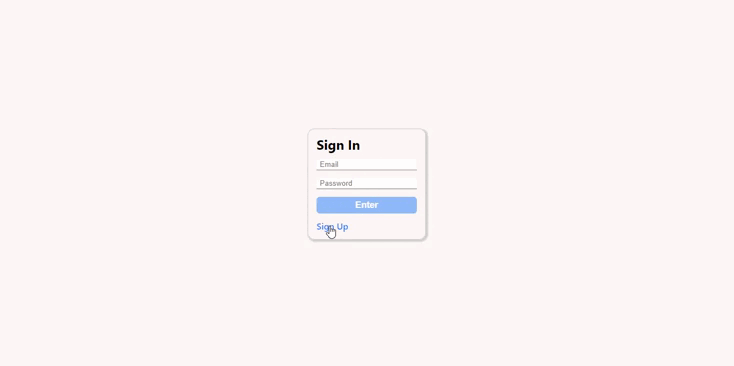

# [ANGULAR] Article Management


> This application aims to act as an article management system, where users can authenticate and view articles created by administrators. Technically, this application is designed for unit testing with Jest and implementing an API created in Nest.Js, all running within Docker. - PT/BR

> Essa aplicação tem como objetivo atuar como um gerenciamento de artigos, onde usuários poderão a partir da autenticação, visualizar artigos criados pelos administradores. Tecnicamente essa aplicação tem como objetivo a realização de testes unitários com Jest, e a implementação de uma API criada em Nest.Js rodando tudo em Docker. - ENGLISH

## Nest.js API
URL to the Nest.js API repository:
- [[Nest.js] article-management](https://github.com/TacioAntonio/nestjs-article-management)

## Installation
```sh
$ git clone https://github.com/TacioAntonio/angular-article-management
$ cd angular-article-management
$ npm i
```

## Running locally
```sh
$ npm start
```

## Running on docker
```sh
$ docker-compose up
```

## Running unit tests
```sh
$ npm run test
```

## Contribution
Please read [CONTRIBUTING.md](https://github.com/TacioAntonio/angular-article-management/blob/master/CONTRIBUTING.md) for details on our code of conduct, and the process for submitting pull requests to us.

## Versioning
We use [SemVer](http://semver.org/) for versioning. For the versions available, see the [tags on this repository](https://github.com/TacioAntonio/angular-article-management/tags).

## Authors
| 
| -
| [Tácio Antônio](https://github.com/TacioAntonio/)

See also the list of [contributors](https://github.com/TacioAntonio/angular-article-management/graphs/contributors) who participated in this project.

## License
This project is licensed under the MIT License - see the [LICENSE.md](https://github.com/TacioAntonio/angular-article-management/blob/master/LICENSE.md) file for details.

